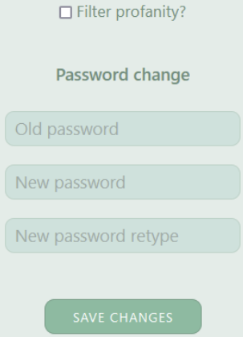
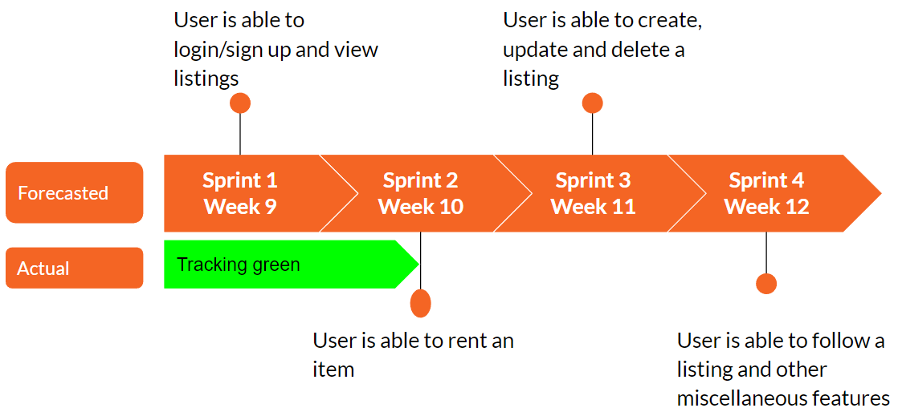
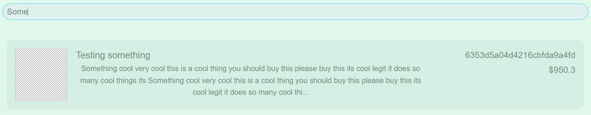
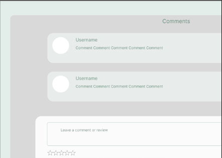
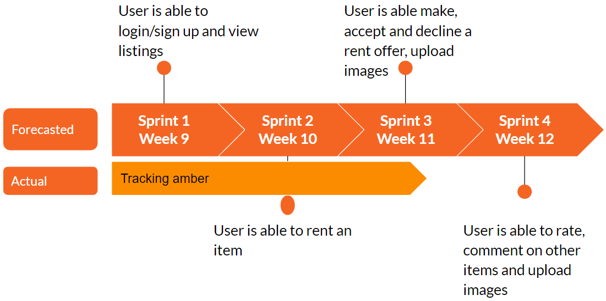
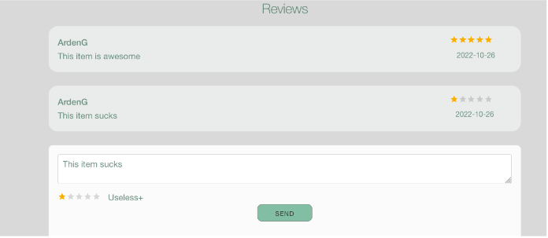
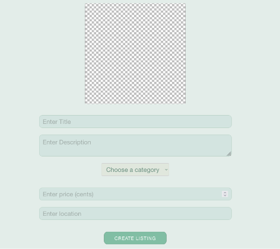
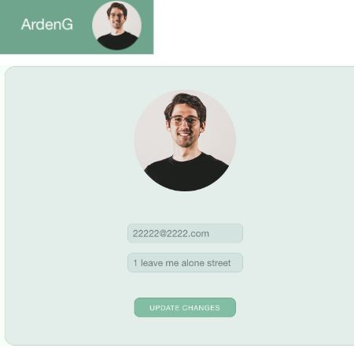
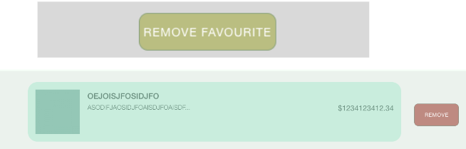
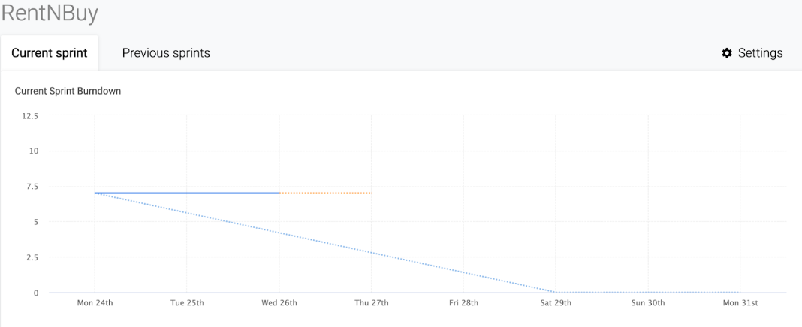

## Milestones (Sprints):
---

#### Sprint 1 - Week 9:
---
- **Sprint Goal:** “User is able to sign up/login and view the listings on the home page”
- **Recent Progress:**
    - Product and Sprint BackLog Grooming - Completed 
    - Sprint Backlog - Completed
    - Basic application talking to the MongoDB database
    - UI (User Interface) / UX (User Experience) - Established
    - Project skeleton for all aforementioned pages (Profile, Settings, Categories etc.) - Completed 
    - Front-end and Back-end Builds - In-Progress
- **Biggest Risk:** None at the moment
- **Completed:**
    - **Product and Sprint BackLog Grooming**
        - Trello board established
            - Team wrote user stories for all tasks for duration of sprint and entire project
            - Team members picked up tasks to be executed during sprint
            - URL to view Trello Board - https://trello.com/b/91SpBsnm/rentnbuy
    - **UI / UX Established**
        - Design done and CSS Framework established
            - Figma designs done
            - CSS incorporated into design
            - URL for the Github - https://github.com/MQCOMP3120/group-project-group-y
        - Login / Sign up page design implemented
            - We've implemented the sign up and sign in page.
            Right now the login is stored in plain-text.
- **In-Progress**
    - **Data Models and Authentication**
        - Data Models
            - Team is currently building the data models and schema definitions 
            - Data seeding to be done by end of sprint
        - Authentication
            - Team is implementing authentication and assessing if we can use OAuth
- **Schedule**

- **Next Steps heading towards Sprint 2 (Sprint 2 Tasks)**
    - Logged in user is able to buy, sell and rent from listings
    - Logged in user is able to create, delete and update their listing 
    - Logged in user is able to favourite a listing 
    - Log in and authentication
    - Logged in user is able to report another user (stretch goal)

#### Sprint 2 - Week 10:
---
- **Sprint Goal:** “User is able to rent a listing”
- **Recent Progress:**
    - Sprint Backlog based on feedback received from Sprint 1 and groups progress - Updated
    - Login, Sign up and Home Pages - Completed 
    - Authentication Mechanism - Established
    - User is able to update their Account Information
- **Biggest Risk:**** Storing images in database is proving to be complex
- **Completed:**
    - **Login, Sign up and Home Page**
        - Login page implemented with latest UX 
        - Sign up page allows users to register with a unique username 
        - Backend provides a valid token on each request
        
    - **User Authentication and Password Storage**
        - Team discussed pros and cons of session and JSON Web Token (jwt)
        - To allow for scalability of app and security,  team implemented jwt 
        - All passwords are stored as hashes in database
        
- **In-Progress**
    - **Renting Journey**
        - Backend for renting an item implemented 
        - Front end in progress 
        - Team is exploring how to store images in database
        
    - **Changing the Users Password**
        - Hashing of password has introduced complexity due to the way token generation is handled 
        - The team have the front end logic and will be implementing  backend as a stretch goal
        
- **Schedule**

- **Next Steps heading towards Sprint 3 (Sprint 3 Tasks)**
    - Logged in user is able to create, delete and update their listing 
    - Logged in user is able to buy, and rent from listings
    - Logged in user is able to favourite a listing 

#### Sprint 3 - Week 11:
---
- **Sprint Goal:** “User is able to make and accept an offer”
- **Recent Progress:**
    - Sprint Backlog - Updated
    - Offer Model - Defined 
    - Offer Accepting and decline - Implemented
    - Search bar - Completed
- **Biggest Risk:** Storing images in database is proving to be complex
- **Completed:**
    - **Updated Project Documentation**
        - User documentation done for other developers and project stakeholders understand how to use and setup the app
        - Programming Documentation in progress 
        
    - **A User can now Make, Accept and/or Decline an Offer**
        - Implementation of working rent request.
        - Sent to creator of the item, who then can approve or deny the request.
        - Confirmation sent back to user.
        
    - **A Search Bar for the User to make Queries**
        - Implementation complete for front and backend
        
- **In-Progress**
    - **Comments and Ratings for an Item**
        - User should be able to add comments on an item 
        - User should be able to rate items
        - Frontend and backend logic in progress
        
    - **Changing the Users Password**
        - Front end implementation in process
        - Backend implementation working 
        - User asked for current and new password
        
- **Schedule**

- **Next Steps heading towards Sprint 4 (Sprint 4 Tasks)**
    - Logged in user is able to upload and view profile and item images
    - Logged in admin is able to delete, view and remove anyone’s listings and add categories

#### Sprint 4 - Week 12:
---
- **Sprint Goal:** “User is able to create, modify a listing, upload images and change their password”
- **Recent Progress:**
    - **Completed**
       - Uploading Images to an item and profile
        - Changing the users password 
        - Creating a Listing
        - Updated main readme with milestones
        - Added comments and ratings to each item
        - Users can favourite an item
    - **In Progress**
        - Modifying a Listing
        - Being able to search by categories
        - Testing the Application

- **Biggest Risk:** None
- **Completed:**
    - **Updated Project Documentation**
        - Sprints 1, 2 and 3 Milestones added to the main ReadMe Markdown file
        - Sprint 4 to be added at the end of this week
        
    - **Changing the Users Password**
        - Front end  and Back end implementation working as anticipated 
        - User is asked for their current and new password before saving any changes
        
    - **A User can add comments and ratings to an item**
        - User can add comments on an item 
        - User can rate items
        - Frontend and backend logic completed
        
    - **A user is able to create a listing**
        - Logged in users can now create a new listing
        - They can add an optional image to this listing
        
    - **Uploading an image to an Item or Profile page**
        - You asked and we delivered - users can now have their photo on their profile! 
        - More importantly, you can post photos of your items up for rent!
        - Images stored in MongoDB and no file size limitation!
        
    - **Favoriting an Item**
        - A logged in user is able to favourite an item which they would like to save in their favourites list. Allowing them to view the item at a later date.
        - Although, if an item is removed it will automatically be removed from their favourites list.
        
- **Schedule**

- **Next Steps heading towards the Final Presentation and Submission of the MVP**
    - Adding an Admin User who is able to manage the application
    - Profanity Filtering by age as well as a setting for any user to trigger this on or off
    - Testing the application using Jest

## References
---
1. MaRS, ‘Product development: Minimum viable product (MVP) approach’, 2022. [Online]. Available at: https://learn.marsdd.com/article/product-development-minimum-viable-product-mvp-approach/
2. Heroku, ‘Documentation: Deployment’, 2022. [Online]. Available at: https://devcenter.heroku.com/categories/reference
3. MongoDB manual ver. 6.0 ‘Getting Started’. [Online]. Available at: https://www.mongodb.com/docs/manual/tutorial/getting-started/
4. Fullstack Open 2022, ‘Deep Dive Into Modern Web Development’. [Online]. Available at: https://fullstackopen.com/en/#course-contents
5. https://developers.google.com/maps/documentation/places/web-service/autocomplete#required-parameters 
6. https://www.telerik.com/blogs/integrating-google-places-autocomplete-api-react-app 

Things left to do
- A description of what you have been able to implement in this MVP, use your milestones to highlight what you've achieved. - Currently Working on this....
- A guide to the project source code - where should we look for what you have done.
- A summary of what your next steps would be if you were to continue the project.
- A summary of the main roles and contributions of each team member and how you managed interaction and communication through the project.