# Group Y
This is the initial README file for GROUP Y in the COMP 3120 Group Project. This README detaills the elements of the application being created by Group Y, including the team members involved in the project, the application and its intended purpose, target user group, use cases and data sources.

## Expected Delivery
Sunday 6th of November (Week 13) at 11:55pm  

## Team Members / Roles / Contact Details
---
This section details the assigned roles of each team member in Group Y. Members will assume responsibility over these development areas, but will also branch out into other areas if support from other members is needed.
| Team Member:         | Assigned Role(s):                    | Student Number: | Student Email:                          |
|----------------------|--------------------------------------|-----------------|-----------------------------------------|
| Nicholas Albert      | Frontend Design, Database management | 46469001        | Nicholas.Albert@students.mq.edu.au      |
| Raffi Tchamkertenian | Backend and Test Specialist          | 46464565        | Raffi.Tchamkertenian@students.mq.edu.au |
| Arden Gourlay        | Frontend Design                      | 46447849        | Arden.Gourlay@students.mq.edu.au        |
| Anubhav Ashish       | Backend Development                  | 45317569        | Anubhav.Ashish@students.mq.edu.au       |

## Application
---
- Name: Rent N Buy
- URL: RnB.com.au or rentnbuy.com.au
- Slogan: “A platform to list, rent, buy and critique anything”
- Purpose: This application will be designed by Group Y  to provide:
    - A platform Rent/Buying application that allows for users to rent and sell items on the site
    - Allow users to give reviews of different services and items
    - Showcasing of associated photos and description of each product

## Target Audience/Users
---
- Potential buyers of a product looking to find what other people think
- Must be 12+ to create an account. The application will filter certain features/pages depending on the users age:
    - Examples will be that it will filter movies and games of a certain rating
    - Profanity filtering for users under the age of 18

## Use Cases:
---
The ‘Rent and Buy’ web application will provide users a platform to either rent and buy their own or others Electronics, Clothing, Shoes, Accessories, Toys, Motors, Sports, Business and Industrial Supplies, Home and Garden, health and beauty, and other categories. There are three types of users: Logged In user, Guest and Administrator. The website is in a view only state when a user is not logged in.

- **User(s) can:**
    - Create or log into an account.
    - Search for items using the search tools.
    - Buy, rent and review products. 
    - Create new categories.
    - Add items to their favourites list.
    - Add items to their cart.
    - Change their password.
    - Change their profanity settings.
    - Delete their own listing, reviews and comments.
    - Follow other Users.
    - Like or dislike comments or reviews.
    - Edit Account Information
- **Guest(s) can:**
    - Create or log into an account. This will comprise of the different categories of items, the listings for each of the items posted by other people. 
    - View the website without being logged in.
    - Search for items using the search tools, however it will be at a restricted view (Profanity Filters).
    - Buy and rent products, but cannot create or critique a listing.
- **Administrator(s) can:**
    - Delete other users (has to provide a mandatory rationale)
    - Delete a listing (has to provide a mandatory rationale)
    - Block other users (has to provide a mandatory rationale)

## Data Sources
---
Group Y will make use of MongoDB as its dedicated backend database, which will be used to store the following potential information:

### Mongo Database (MongoDB)
---
| Session |  User | Item | Categories | Review | Comments |
|---------|----------------------------------------------------------------|-------------|--------------------|----------------------------------------------------------------------------------------|----------------------------------------------------------------------------------------|
| UserID  | UserID                                                         | _id         | CategoryID         | ItemID                                                                                 | ReviewID                                                                               |
| Token   | Username                                                       | Name        | Image              | UserID (owner of the review)                                                           | CommentID                                                                              |
|         | password                                                       | Rating      | Name               | ReviewID                                                                               | UserID                                                                                 |
|         | firstName                                                      | Price       | CreatorID (UserID) | Text                                                                                   | Text                                                                                   |
|         | LastName                                                       | creatorId   |                    | Date                                                                                   | Date                                                                                   |
|         | passwordHash                                                   | Location    |                    | Helpfulness                                                                            | Likes                                                                                  |
|         | Image                                                          | Description |                    | UsersWhoHaveVoted (array keeping track of users who have marked the review as helpful) | UsersWhoHaveliked (array keeping track of users who have marked the review as helpful) |
|         | Age                                                            | isAvailable |                    | Stars                                                                                  |                                                                                        |
|         | Birthday                                                       | timestamp   |                    | Comments                                                                               |                                                                                        |
|         | isAdmin                                                        |             |                    |                                                                                        |                                                                                        |
|         | Phone Number                                                   |             |                    |                                                                                        |                                                                                        |
|         | Email Address                                                  |             |                    |                                                                                        |                                                                                        |
|         | Favourites (Array of items user has favourited)                |             |                    |                                                                                        |                                                                                        |
|         | Settings (Various flags for setting such as profanity filters) |             |                    |                                                                                        |                                                                                        |
|         | Location                                                       |             |                    |                                                                                        |                                                                                        |
|         | Reviews                                                        |             |                    |                                                                                        |                                                                                        |
|         | myItems                                                        |             |                    |                                                                                        |                                                                                        |
|         | boughtItems                                                    |             |                    |                                                                                        |                                                                                        |
|         | rentedItems                                                    |

### Local Storage (Cookies)
---
|          |                                                                      |
|----------|----------------------------------------------------------------------|
| Cookies: | Cart details (Object containing an array of items, the total cost) |
|          | SessionID / JWT / method of identifying user                       |

## Note: There exists no other Github for this application!
---

## Minimum Viable Product (MVP)
---
This section details the features that Group Y aims to include in its MVP that will be reviewed at the end of the assessment period, including the target features, complex features that might be omitted during development and out-of-scope features that will not be included due to time constraints.

### Target Features:
---
- **User Login / Login Page (Landing Page)**
    - When a user is not logged in, automatic profanity filters will be applied to restrict content.
    - Users can sign up, login and logout
    - Users can login and checkout as a guest, which will not require any credentials or personal information. 
    - Users must be 12+ to create an account.. Users under 18 will have content and profanity filtering
- **User Account**
    - **Small user Icon in the top right corner**
        - Clicking on this will display a drop down of options (Profile Page, Settings Page, etc)
    - **Profile Page / Account Info**
        - View and Edit Account Information
    - **Settings Page**
        - User can Change their Password
        - Turn profanity on and off (This setting is only available for users 18 or over - as those under are automatically enabled)
- **Categories Pages (Displays Different Categories as Big icons (with photos))**
    - User can click on a category to navigate to its page
    - Users can create a category
    - Users can only create categories that are appropriate
- **Sell, Rent and Delete Items (Posting/Adding/Removing)**
    - Each item will have a Unique Identifier (Randomly generated Unique string (Length of x))
    - Each Item will have a button to save it for a user.
    - Publish a review
    - Filtering reviews/comments for profanity
    - Filter reviews by amount of stars / most helpful
    - Rate reviews as helpful
    - Likes and Dislikes on comments
    - Delete items, comments, reviews
    - Reporting Items
- **Add Items to Cart (Shopping Cart)**
- **Follow a seller (Like adding a friend)**
    - Notification Button
- **Item Feed (If logged in, come here)**
    - Search Bar (By Word and category)
    - First shows people following/Interested in and then the rest.
- **Search and Search Filter**
- **Favorites List**
- **Admin User**
    - Their own page to administer the application
    - Admin will have the highest privilege

### Complex Features:
---
- Auth0 - For login, users can sign up through Google. Complexity in storing user information with this method.
- Google Single Sign on 
- Payment features
- Blocking a user 
- Filter by nearby items (use of location services)
    - ‘useCurrentLocation’: Can be used for search filtering by radius

### Out of Scope Features:
---
| Feature Id | Description                        | Rationale for exclusion                                                                                                                                                                                                  |
|------------|-----------------------------------------------------------------------------------------|--------------------------------------------------------------------------------------------------------------------------------------------------------------------------------------------------------------------------|
| OOS1       | End to end payment process using a payment gateway                                      | End to end payment gateway will allow for real payments being made. Given that this is a demo application, the team does not see value in implementing this feature. There will however be a mock payment functionality. |
| OOS2       | Terms of use, legal, privacy and posting policy                                         | Given no real users will be onboarded as part of this exercise, no legal work will be undertaken.                                                                                                                        |
| OOS3       | Use of paid tiered services for hosting and building the application and its components | This is a demo app and will not have real traffic. As such, the team will not be paying for any tiered services for building the application.                                                                            |
| OOS4       | Database performance tuning                                                             | This is a demo app with no real users. Database tuning is not required for a small sample of users.                                                                                                                      |
| OOS5       | Penetration Testing and vulnerability management                                        | The team will not be pen testing as part of the MVP. They will however adhere to good design practices to ensure security of the app.                                                                                    |
| OOS6       | User experience testing                                                                 | The team will not be conducting exercises to determine user experience as part of MVP.                                                                                                                                   |

## Project Plan
---
This section details the goals set by Group Y for each sprint over the following weeks. This will progress from the initial setup of the web application all the way to the final MVP. The milestones for weeks 9, 10, 11 and 12 are as follows:

### Milestones (Sprints):
---

#### Sprint 1 - Week 9:
---
- **Sprint Goal:** “User is able to sign up/login and view the listings on the home page”
- **Recent Progress:**
    - Product and Sprint BackLog Grooming - Completed 
    - Sprint Backlog - Completed
    - Basic application talking to the MongoDB database
    - UI (User Interface) / UX (User Experience) - Established
    - Project skeleton for all aforementioned pages (Profile, Settings, Categories etc.) - Completed 
    - Front-end and Back-end Builds - In-Progress
- **Biggest Risk:** None at the moment
- **Completed:**
    - **Product and Sprint BackLog Grooming**
        - Trello board established
            - Team wrote user stories for all tasks for duration of sprint and entire project
            - Team members picked up tasks to be executed during sprint
            - URL to view Trello Board - https://trello.com/b/91SpBsnm/rentnbuy
    - **UI / UX Established**
        - Design done and CSS Framework established
            - Figma designs done
            - CSS incorporated into design
            - URL for the Github - https://github.com/MQCOMP3120/group-project-group-y
        - Login / Sign up page design implemented
            - We've implemented the sign up and sign in page.
            Right now the login is stored in plain-text.
- **In-Progress**
    - **Data Models and Authentication**
        - Data Models
            - Team is currently building the data models and schema definitions 
            - Data seeding to be done by end of sprint
        - Authentication
            - Team is implementing authentication and assessing if we can use OAuth
- **Schedule**
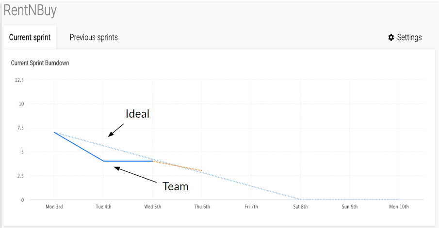
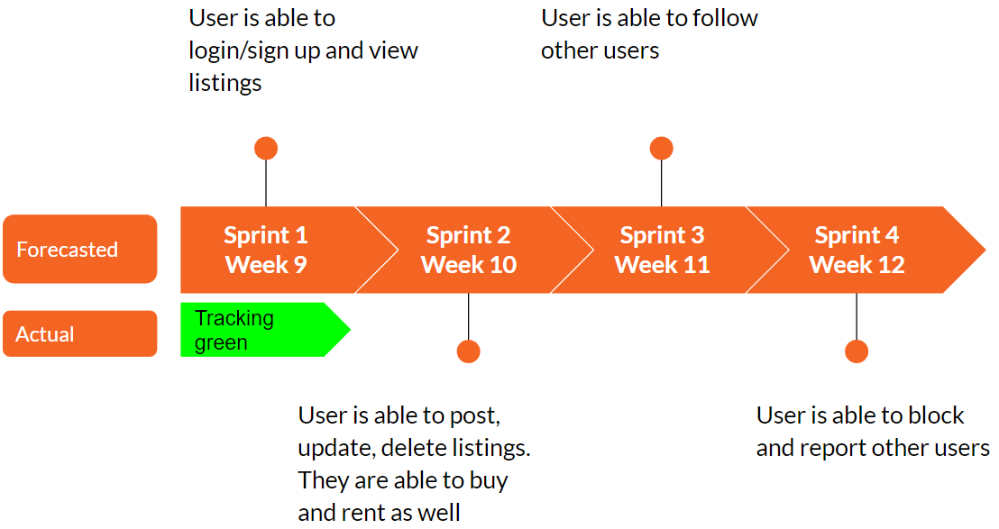

- **Next Steps heading towards Sprint 2 (Sprint 2 Tasks)**
    - Logged in user is able to buy, sell and rent from listings
    - Logged in user is able to create, delete and update their listing 
    - Logged in user is able to favourite a listing 
    - Log in and authentication
    - Logged in user is able to report another user (stretch goal)

#### Sprint 2 - Week 10:
---
- **Sprint Goal:** “User is able to rent a listing”
- **Recent Progress:**
    - Sprint Backlog based on feedback received from Sprint 1 and groups progress - Updated
    - Login, Sign up and Home Pages - Completed 
    - Authentication Mechanism - Established
    - User is able to update their Account Information
- **Biggest Risk:**** Storing images in database is proving to be complex
- **Completed:**
    - **Login, Sign up and Home Page**
        - Login page implemented with latest UX 
        - Sign up page allows users to register with a unique username 
        - Backend provides a valid token on each request
        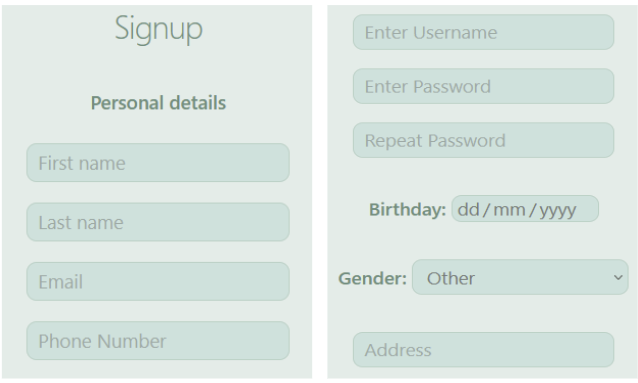
    - **User Authentication and Password Storage**
        - Team discussed pros and cons of session and JSON Web Token (jwt)
        - To allow for scalability of app and security,  team implemented jwt 
        - All passwords are stored as hashes in database
        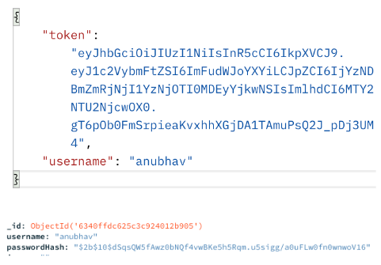
- **In-Progress**
    - **Renting Journey**
        - Backend for renting an item implemented 
        - Front end in progress 
        - Team is exploring how to store images in database
        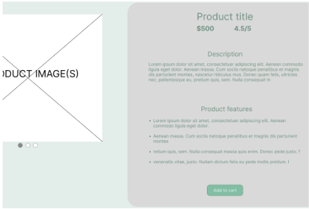
    - **Changing the Users Password**
        - Hashing of password has introduced complexity due to the way token generation is handled 
        - The team have the front end logic and will be implementing  backend as a stretch goal
        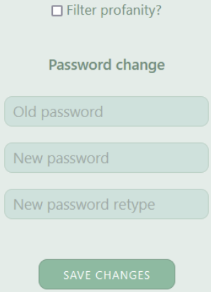
- **Schedule**
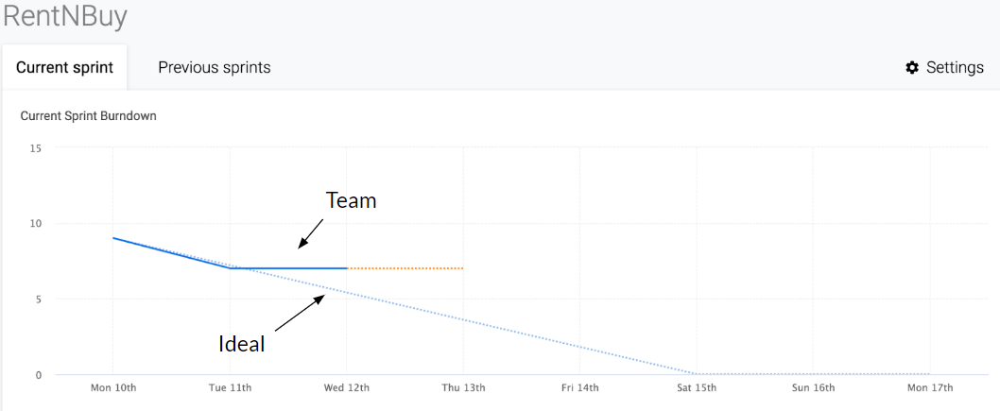
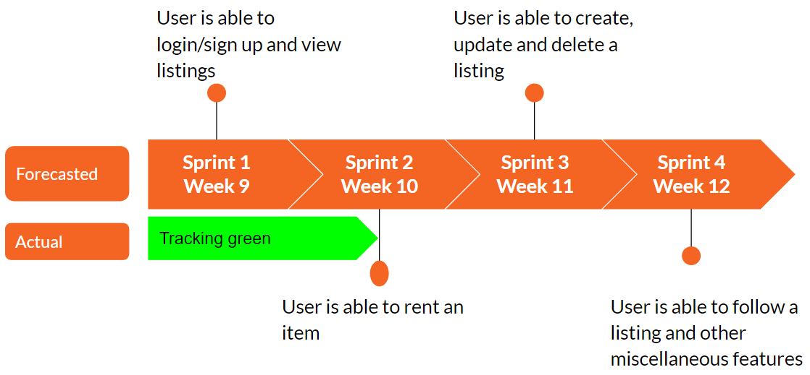
- **Next Steps heading towards Sprint 3 (Sprint 3 Tasks)**
    - Logged in user is able to create, delete and update their listing 
    - Logged in user is able to buy, and rent from listings
    - Logged in user is able to favourite a listing 

#### Sprint 3 - Week 11:
---
- **Sprint Goal:** “User is able to make and accept an offer”
- **Recent Progress:**
    - Sprint Backlog - Updated
    - Offer Model - Defined 
    - Offer Accepting and decline - Implemented
    - Search bar - Completed
- **Biggest Risk:** Storing images in database is proving to be complex
- **Completed:**
    - **Updated Project Documentation**
        - User documentation done for other developers and project stakeholders understand how to use and setup the app
        - Programming Documentation in progress 
        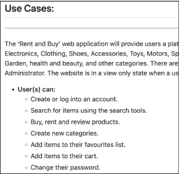
    - **A User can now Make, Accept and/or Decline an Offer**
        - Implementation of working rent request.
        - Sent to creator of the item, who then can approve or deny the request.
        - Confirmation sent back to user.
        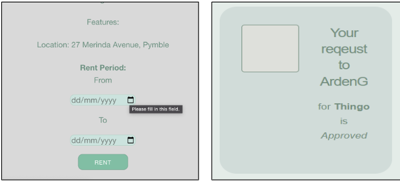
    - **A Search Bar for the User to make Queries**
        - Implementation complete for front and backend
        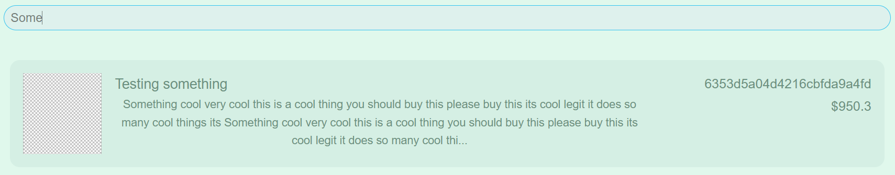
- **In-Progress**
    - **Comments and Ratings for an Item**
        - User should be able to add comments on an item 
        - User should be able to rate items
        - Frontend and backend logic in progress
        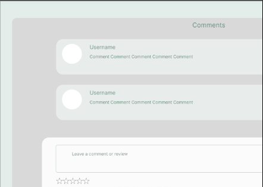
    - **Changing the Users Password**
        - Front end implementation in process
        - Backend implementation working 
        - User asked for current and new password
        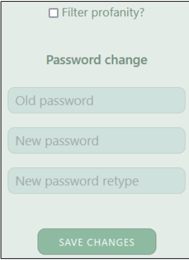
- **Schedule**
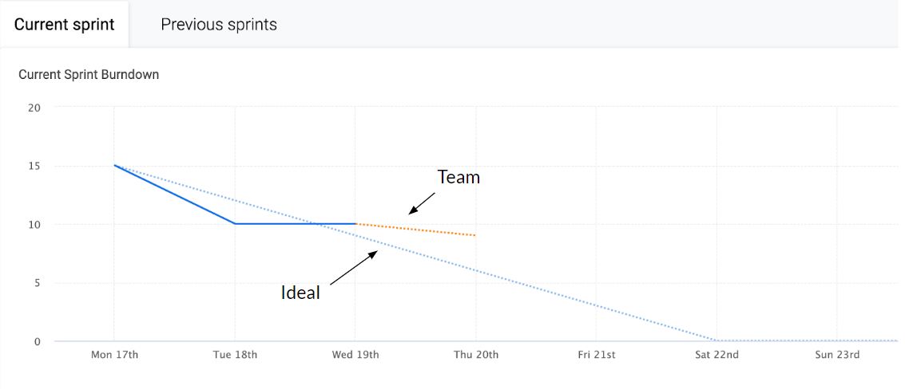
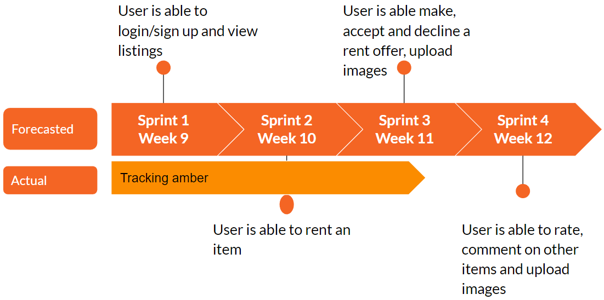
- **Next Steps heading towards Sprint 4 (Sprint 4 Tasks)**
    - Logged in user is able to upload and view profile and item images
    - Logged in admin is able to delete, view and remove anyone’s listings and add categories

#### Sprint 4 - Week 12:
---
- **Sprint Goal:** “User is able to create, modify a listing, upload images and change their password”
- **Recent Progress:**
    - **Completed**
       - Uploading Images to an item and profile
        - Changing the users password 
        - Creating a Listing
        - Updated main readme with milestones
        - Added comments and ratings to each item
        - Users can favourite an item
    - **In Progress**
        - Modifying a Listing
        - Being able to search by categories
        - Testing the Application

- **Biggest Risk:** None
- **Completed:**
    - **Updated Project Documentation**
        - Sprints 1, 2 and 3 Milestones added to the main ReadMe Markdown file
        - Sprint 4 to be added at the end of this week
        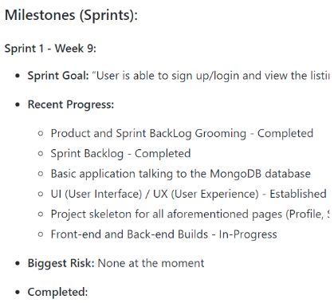
    - **Changing the Users Password**
        - Front end  and Back end implementation working as anticipated 
        - User is asked for their current and new password before saving any changes
        
    - **A User can add comments and ratings to an item**
        - User can add comments on an item 
        - User can rate items
        - Frontend and backend logic completed
        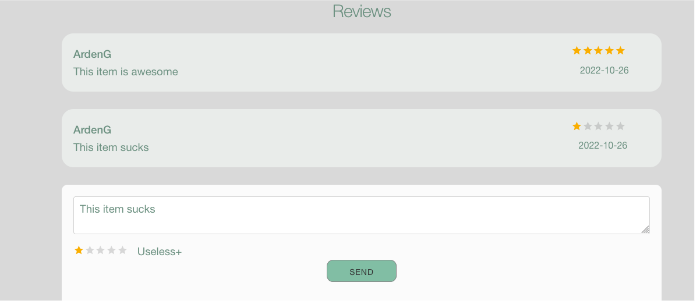
    - **A user is able to create a listing**
        - Logged in users can now create a new listing
        - They can add an optional image to this listing
        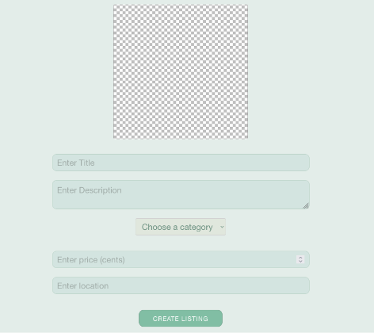
    - **Uploading an image to an Item or Profile page**
        - You asked and we delivered - users can now have their photo on their profile! 
        - More importantly, you can post photos of your items up for rent!
        - Images stored in MongoDB and no file size limitation!
        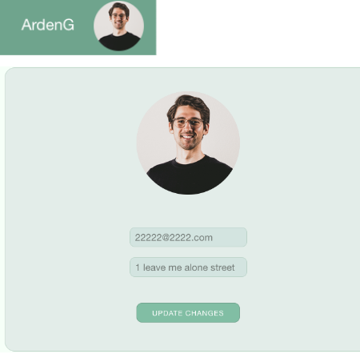
    - **Favoriting an Item**
        - A logged in user is able to favourite an item which they would like to save in their favourites list. Allowing them to view the item at a later date.
        - Although, if an item is removed it will automatically be removed from their favourites list.
        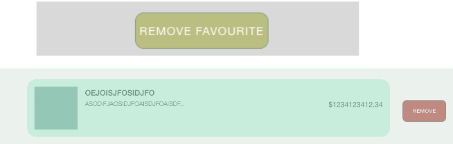
- **Schedule**
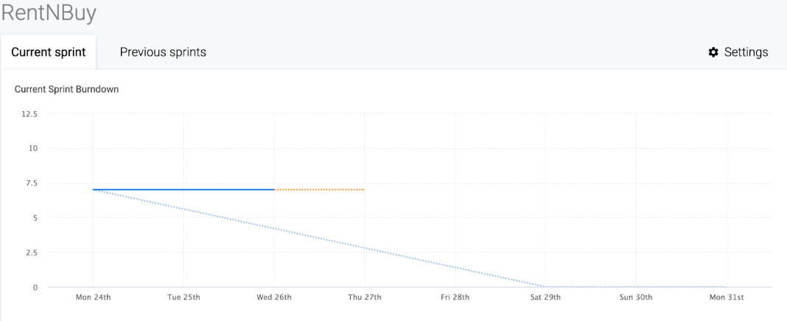
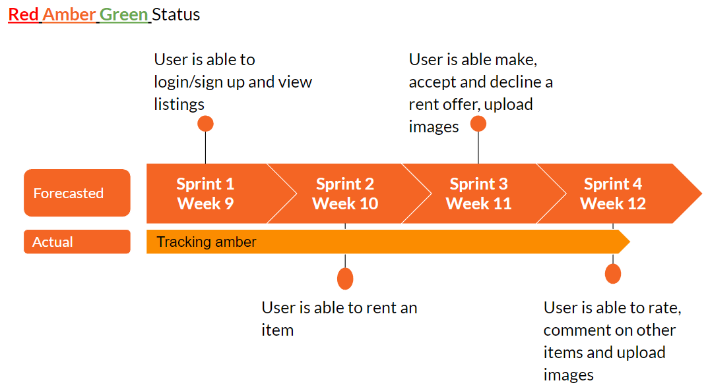
- **Next Steps heading towards the Final Presentation and Submission of the MVP**
    - Adding an Admin User who is able to manage the application
    - Profanity Filtering by age as well as a setting for any user to trigger this on or off
    - Testing the application using Jest

## References
---
1. MaRS, ‘Product development: Minimum viable product (MVP) approach’, 2022. [Online]. Available at: https://learn.marsdd.com/article/product-development-minimum-viable-product-mvp-approach/
2. Heroku, ‘Documentation: Deployment’, 2022. [Online]. Available at: https://devcenter.heroku.com/categories/reference
3. MongoDB manual ver. 6.0 ‘Getting Started’. [Online]. Available at: https://www.mongodb.com/docs/manual/tutorial/getting-started/
4. Fullstack Open 2022, ‘Deep Dive Into Modern Web Development’. [Online]. Available at: https://fullstackopen.com/en/#course-contents

Things left to do
- A description of what you have been able to implement in this MVP, use your milestones to highlight what you've achieved. - Currently Working on this....
- A guide to the project source code - where should we look for what you have done.
- A summary of what your next steps would be if you were to continue the project.
- A summary of the main roles and contributions of each team member and how you managed interaction and communication through the project.